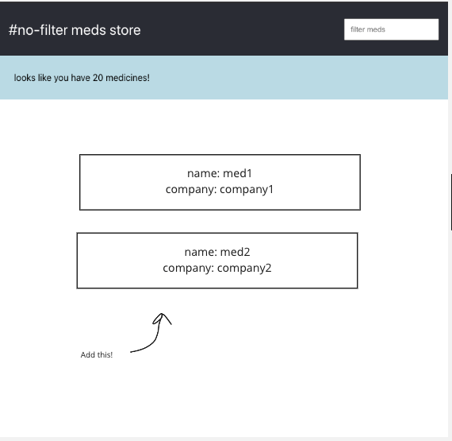

# 03 Project - hashtag-no-filter 
[TL;DR; video](https://www.loom.com/share/654407cd008a4bcb8b80349b56052009)

<details>
  <summary>Marking Criteria</summary>
  <br />
  The following Learning Outcomes are assessed using the below criteria:

  <table>
    <tr>
      <td>LO6</td>
      <td>Use software development standards to implement a user interface</td>
      <td>2 Credits</td>
    </tr>
    <tr>
      <td>LO8</td>
      <td>Implement responsive design (with device and platform independence) using basic principles of user interface design (UI), with considerations for user experience (Ux), HCI principles, and universal accessibility.</td>
      <td>2 Credits</td>
    </tr>
      <tr>
      <td>LO14</td>
      <td>Migrate a web solution from development to a testing environment</td>
      <td>1 Credit</td>
    </tr>
    <tr>
      <td>LO16</td>
      <td>Configure applications to meet requirements and obtain client acceptance.</td>
      <td>1 Credit</td>
    </tr>
    <tr>
      <td colspan="2">
        Total credit weighting counting towards the final grade of WDD03
      </td>
      <td>
        6 Credits<br />(20.00%)
      </td>
    </tr>
  </table>

  To receive the LO credits - all summative projects must receive a C- Grade
  (50% or higher).

  <table>
    <tr>
      <th>Project Component</th>
      <th>Acceptance criteria</th>
      <th>Component weighting</th>
      <th>Assessment Grade</th>
    </tr>
    <tr>
      <td>Part A</td>
      <td>
        Meets the acceptance criteria for Part A. Automated tests pass. Feedback
        completed.
      </td>
      <td>20%</td>
      <td></td>
    </tr>
     <tr>
      <td>Part B</td>
      <td>
        Meets the acceptance criteria for Part B. Automated tests pass. Feedback
        completed.
      </td>
      <td>20%</td>
      <td></td>
    </tr>
     <tr>
      <td>Part C</td>
      <td>
        Meets the acceptance criteria for Part C. Automated tests pass. Feedback
        completed.
      </td>
      <td>20%</td>
      <td></td>
    </tr>
     <tr>
      <td>Part D</td>
      <td>
        Meets the acceptance criteria for Part D. Automated tests pass. Feedback
        completed.
      </td>
      <td>20%</td>
      <td></td>
    </tr>
    <tr>
      <td>Code quality</td>
      <td>
        Code looks professional and is formatted in a consistent manner. Code is
        easy to read and understand, with comments and well named functions and
        variables. There is little to no repetition in logic. No
        errors/bugs/syntax problems.
      </td>
       <td>10%</td>
      <td></td>
    </tr>
    <tr>
      <td>Development process</td>
      <td>
        Submitted correctly in GitHub Classrooms. Includes at least one commit
        per project part, demonstrating progression of development. Clear commit
        messages.
      </td>
       <td>10%</td>
       <td></td> 
    </tr>
    <tr>
      <th colspan="2" align="left">Total grade</th>
      <td>100%</td>
      <td></td>
    </tr>
  </table>
</details>

<details>
  <summary>Marking Scale</summary>
  <br />
  <table>
    <tr>
      <th>Marking Scale</th>
      <th>Descriptor</th>
    </tr>
    <tr>
      <td>10</td>
      <td>Excellent</td>
    </tr>
    <tr>
      <td>9</td>
      <td>Great</td>
    </tr>
    <tr>
      <td>8</td>
      <td>Very Good</td>
    </tr>
    <tr>
      <td>7</td>
      <td>Good</td>
    </tr>
    <tr>
      <td>6</td>
      <td>Average</td>
    </tr>
    <tr>
      <td>5</td>
      <td>Satisfactory</td>
    </tr>
    <tr>
      <td>4</td>
      <td>Some effort</td>
    </tr>
    <tr>
      <td>3</td>
      <td>Un-satisfactory</td>
    </tr>
    <tr>
      <td>2</td>
      <td>Incomplete</td>
    </tr>
    <tr>
      <td>1</td>
      <td>Poor</td>
    </tr>
    <tr>
      <td>0</td>
      <td>Did Not Complete</td>
    </tr>
  </table>
</details>


## Brief

At #no-filter meds store, there are so many meds it's hard to keep track.

Let's improve the user experience by allowing them to filter by med or company name.


## Rationale

Filtering data on the client is really common!  We'll also put into practice the react best practices we've learnt around component composition, state and props.

## Instructions Part A - Render Meds details

A basic layout already exists.  Run `npm i && npm start` to spin it up.  You should see a basic layout with header and search box.

Run `npm test` to run the tests.  They will gradually pass as you implement the required features.  Check them out at `./App.test.js` to see how they work!

Display a component for each med.  Styles are up to your judgement, but display name and company details as per the mockup:



## Instructions Part B - Implement filter
Get the filter/search box functional.
- When this box is empty all meds should be visible.
- When this box is populated the meds should filter on matches for med name OR company name.
- filter term is case insensitive

## Instructions Part C - Add syntactic message nicities.
the message counter component should be correctly pluralised:

- when more than one med: `looks like you have x medicines!`
- when exactly one med: `looks like you have 1 medicine!`  (lose the 's')
- when 0 meds: `looks like you don't have any medicines!`

## Instructions Part D - Deploy
- build and deploy your killer app to a publicly accessible site
- ensure it functions on mobile screens
- stick the link in `url-of-my-site.txt`


--- 

# Submit your Project

- [ ] [Feedback](feedback.md) has been completed, and committed to git
- [ ] Commits are pushed to GitHub

---

<details>
  <summary>
    Git CLI Refresher
  </summary>

If you need help remembering what commands to type with `git`, use the following as a reference, or watch the [git walkthrough tutorial video](https://vimeo.com/433825571/bc1830fb90)

```shell
# when ready to commit and push
git add .

git commit -m "Completed Part A"

git push origin master
```

</details>
